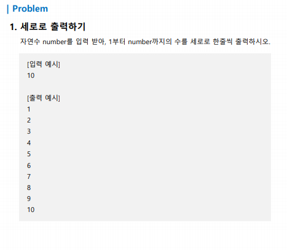
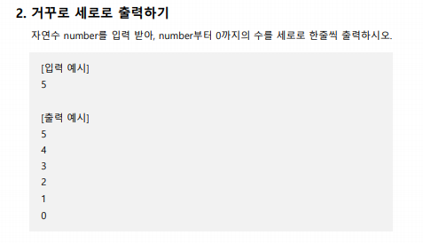
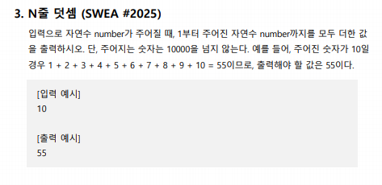

**ans for 1:**

```python
a = int(input())
for i in range(1, a + 1):
	print(i)
```




**ans for 2:**

```python
a = int(input())
for i in range(a, -1, -1):
	list(i)
```




**ans for 3:**

```python
a = int(input())
ans = 0
for i in range(a + 1):
	ans = ans + i
print(ans)
```

