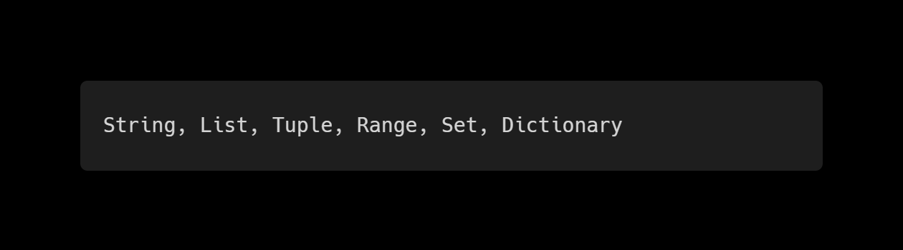
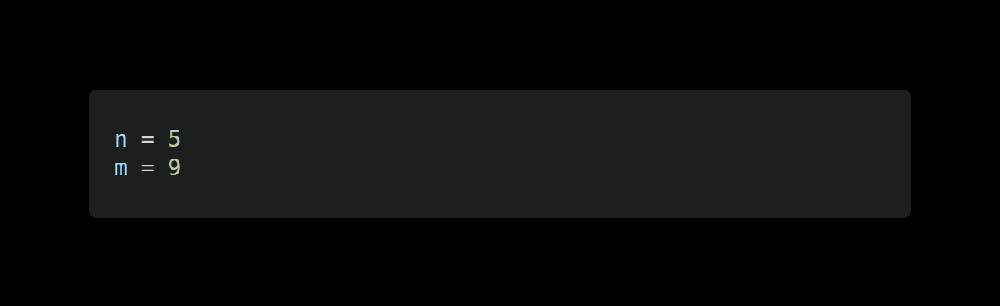
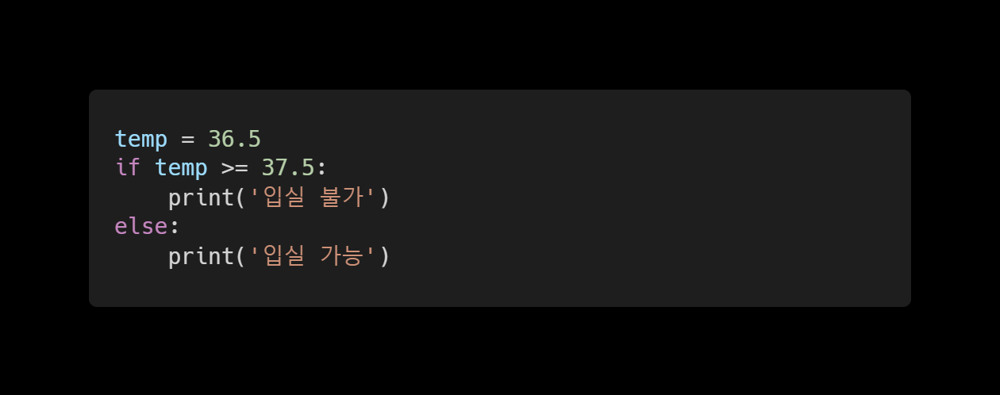
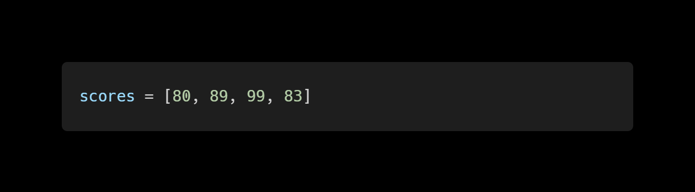

1. **Mutable & Immutable**
**주어진 컨테이너들을 각각 변경 가능한 것(mutable)과 변경 불가능한 것(immutable)으로 분류하시오.**



**ans for 1:**

```python
변경 가능(mutable): list, set, dictionary
변경 불가능(immutable): string, tuple, range
```


2. **홀수만 담기**
**range와 slicing을 활용하여 1부터 50까지의 숫자 중, 홀수로만 이루어진 리스트를 만드시오.**

**ans for 2:**

```python
a = range(1, 51)
l_ist = []
for i in a:
	if i % 2 == 1:
		l_ist.append(i)
	else:
		continue
print(l_ist)
```

```python
# 교수님 답안
a = list(range(1, 51))
b = a[0:-1:2] # b = a[::2] 또한 가능
```


3. **Dictionary 만들기**
**반 학생들의 정보를 이용하여 key는 이름, value는 나이인 dictionary를 만드시오.**

**ans for 3:**

```python
class_python1 = {'박정현': 26, '배준식': 26}
```

```python
student = {'박정현': 26, '싸피': 7}
```


4. **반복문으로 네모 출력**
**두 개의 정수 n과 m이 주어졌을 때, 가로의 길이가 n, 세로의 길이가 m인 직사각형 형태를 별(*) 문자를 이용하여 출력하시오. 단, 반복문을 사용하여 작성하시오**



**ans for 4:**

```python
n = 5
m = 9
ga_ro = '*' * n
for i in range(m):
	print(ga_ro)
```

```python
# 교수님 답안
for height in range(m):
    print('*'*n)
    
# 반복문 중첩
for height in range(m):
    for width in range(n):
        print('*', end='') #print함수가 가진 줄바꿈을 실행되지 않도록 설정
    print()
#m부터 실행하는 이유는?
#-> 위와 같은 방식으로 작성된 코드는 n에 대한 for문이 한 싸이클 다 돈 후 m에 대한 두번째 사이클이 시작되므로, 가로를 먼저 돌리고 세로로 넘어가 줄을 바꿔주는 형식으로 진행됨.
```


5. **조건 표현식**
**주어진 코드의 조건문을 조건 표현식으로 바꾸어 작성하시오.**



**ans for 5:**

```python
temp = 36.5

print('입실 불가') if temp >= 37.5 else print('입실 가능')
```


6. **평균 구하기**
**주어진 list에 담긴 숫자들의 평균값을 출력하시오.**



**ans for 6:**

```python
scores = [80, 89, 99, 83]
ans = 0
for i in scores:
	ans = ans + i

ave = ans / len(scores)
print(ave)
```

```python
# 교수님 답변
total = 0
count = 0
for score in scores:
    total += score
    count += 1
    
ave = total / count
print(ave)

# 또는
print(sum(scores)/len(scores))
```

