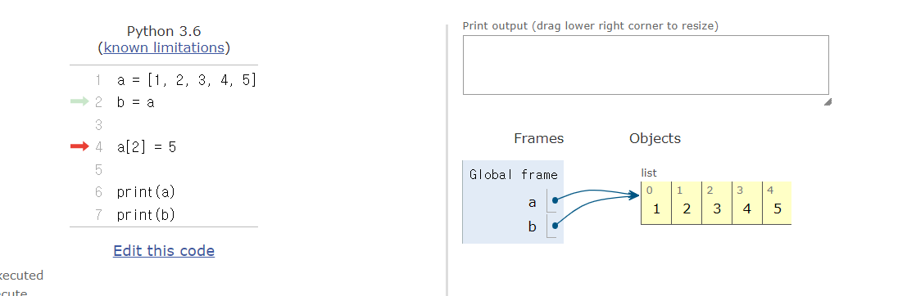

# HomeWork

### Built-in 함수와 메서드

sorted()와 .sort()의 차이점을 코드의 실행 결과를 활용하여 설명하시오.

**ans for 1:**

```python
ex)
#sorted()
a = [1, 5, 3, 8]
b = sorted(a)
print(b) -> [1, 3, 5, 8]
print(a) -> [1, 5, 3, 8]
# sorted()의 경우 ()안의 값을 정렬하여 반환해줌.
# ()안의 값을 정렬한 상태로 수정하진 않음.

#.sort()
a = [1, 5, 3, 8]
b = a.sort()
print(b) -> None
print(a) -> [1, 3, 5, 8]
# .sort()의 경우 .sort()앞에 오는 list를 수정하는 효과를 가짐.
# a.sort()는 a를 정렬해준다는 의미이므로, 값을 반환하여 b에 할당할 수 없음. 그래서 print(b) 했을 때 None 나오는거
```


### .extend()와 .append()

.extend()와 .append()의 차이점을 코드의 실행 결과를 활용하여 설명하시오.

**ans for 2:**

```python
L = [1, 2, 3, 4, 5, 6, 7]
m = [8, 9]
L.extend(m) -> L = [1, 2, 3, 4, 5, 6, 7, 8, 9]
L.append(0) -> L = [1, 2, 3, 4, 5, 6, 7, 8, 9, 0]

# L.extend(m)는 iterable m의 모든 항목을 리스트 L의 끝부분에 추가해줌
# L.append(x)는 리스트 마지막에 항목 x를 추가해줌
```


### 복사가 잘 된 건가?

아래의 코드를 실행 하였을 때, 변수 a와 b에 담긴 list의 요소가 같은지 혹은 다른지
여부를 판단하고 그 이유를 작성하시오.

```python
a = [1, 2, 3, 4, 5]
b = a

a[2] = 5

print(a)
print(b)
```

**ans for 3:**

```python
# 예상
-> print(a)의 결과는 [1, 2, 5, 4, 5]
-> print(b)의 결과는 [1, 2, 3, 4, 5]

# 실행 결과
-> print(a)의 결과는 [1, 2, 5, 4, 5]
-> print(b)의 결과는 [1, 2, 5, 4, 5]

# 이유는?
-> 사진 참조
```



```python
b = a를 하는 순간, b는 a와 같은 리스트를 바라보게 됨.
바라보고 있던 리스트의 3번째 요소를 5로 바꾸어 주었으므로, b 또한 a와 함께 변하게 됨.
```

```python
a = [6, 8, 3, 4, 5]
b = a
sorted(a)
print(a) -> [6, 8, 3, 4, 5]
print(b) -> [6, 8, 3, 4, 5]

# sorted()의 경우 a의 값을 수정하는 것이 아니므로 변화 X
```

```python
a = [6, 8, 3, 4, 5]
b = a
a.sort()
print(a) -> [3, 4, 5, 6, 8]
print(b) -> [3, 4, 5, 6, 8]

# .sort()를 통해 a와 b가 바라보고 있는 리스트를 수정했으므로, b 또한 수정된 값으로 들어감
```

```python
a = [6, 8, 3, 4, 5]
b = a
b.sort()
print(a) -> [3, 4, 5, 6, 8]
print(b) -> [3, 4, 5, 6, 8]

# 위와 마찬가지. a와 b가 바라보고 있는 리스트를 수정했으므로 이하생략
```

```python
a = [6, 8, 3, 4, 5]
b = sorted(a)
print(a) -> [6, 8, 3, 4, 5]
print(b) -> [3, 4, 5, 6, 8]

# sorted()를 이용해 정렬된 a의 값을 b에 할당했으므로 b는 정렬된 a의 값. sorted()의 경우 a를 직접적으로 수정할 수 없기 때문에 a는 그대로
```

