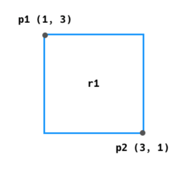

# WorkShop
### 도형 만들기
아래의 명세를 읽고 Python 클래스를 활용하여 점(Point)과 사각형(Rectangle)을
표현하시오.

Point 클래스에 대한 명세는 다음과 같다.

| 인스턴스 변수 | 타입 | 설명   |
| ------------- | ---- | ------ |
| x             | int  | x 좌표 |
| y             | int  | y 좌표 |

예를 들어, 좌표 (4, 3)의 점은 아래와 같이 표현할 수 있다.

```python
p1 = Point(4, 3)
```


Rectangle 클래스에 대한 명세는 다음과 같다.

| 인스턴스 변수 | 타입           | 설명           |
| ------------- | -------------- | -------------- |
| p1            | Point 인스턴스 | 좌측 상단 좌표 |
| p2            | Point 인스턴스 | 우측 하단 좌표 |

| 메서드        | 매개변수                       | 반환값(타입)         | 설명                                                         |
| ------------- | ------------------------------ | -------------------- | ------------------------------------------------------------ |
| (생성자)      | Point 인스턴스, Point 인스턴스 | 없음                 | 인스턴스가 생성 될 때, 2개의 Point 인스턴스를 전달 받아, 인스턴스 변수 p1과 p2를 초기화 한다. |
| get_area      | 없음                           | 넓이(int)            | 사각형의 넓이를 계산하여 반환한다.                           |
| get_perimeter | 없음                           | 둘레 길이(int)       | 사각형의 둘레 길이를 계산 하여 반환한다.                     |
| is_square     | 없음                           | 정사각형 유무 (bool) | 사각형이 정사각형이면 True, 정사각형이 아니면 False를 반환한다. |

예를 들어, 좌측 상단 좌표 (1, 3)과 우측 하단 좌표 (3, 1)의 점으로 만든 사각형을 그림으로 표현하면 다음과 같다.



```python
p1 = Point(1, 3)
p2 = Point(3, 1)
r1 = Rectangle(p1, p2)
print(r1.get_area())
print(r1.get_perimeter())
print(r1.is_square())
p3 = Point(3, 7)
p4 = Point(6, 4)
r2 = Rectangle(p3, p4)
print(r2.get_area())
print(r2.get_perimeter())
print(r2.is_square())
```

위의 코드를 실행하였을 때, 아래와 같이 출력되어야 한다.

```python
4
8
True
6
10
True
```

**ans for 1:**

```python
class Point:

    def __init__(self, x, y):
        self.x = x
        self.y = y

class Rectangle:

    def __init__(self, p1, p2):
        self.p1 = p1
        self.p2 = p2
        self.width = abs(p1.x - p2.x)
        self.height = abs(p1.y - p2.y)

    def get_area(self):
        return self.width * self.height

    def get_perimeter(self):
        return (self.width + self.height) * 2

    def is_square(self):
        if self.get_area() == self.width ** 2:
            return True
        else:
            return False

p1 = Point(1, 3)
p2 = Point(3, 1)
r1 = Rectangle(p1, p2)
print(r1.get_area())
print(r1.get_perimeter())
print(r1.is_square())
p3 = Point(3, 7)
p4 = Point(6, 4)
r2 = Rectangle(p3, p4)
print(r2.get_area())
print(r2.get_perimeter())
print(r2.is_square())
```

