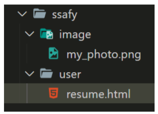
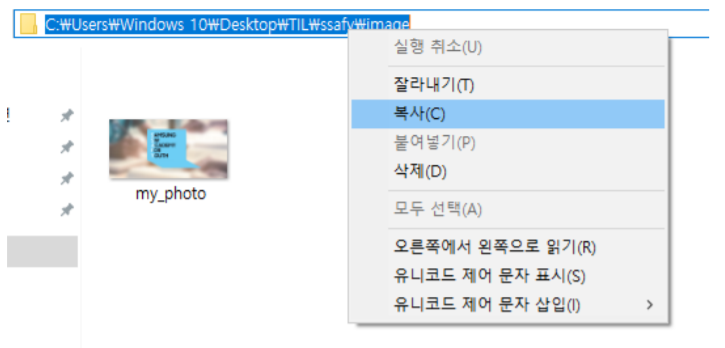

# WorkShop

### img tag

아래 그림과 같은 폴더 구조가 있다. resume.html에서 코드를 작성 중일 때, image폴더 안의 my_photo.png를 보여주는  tag를 작성하시오.
단, 이미지가 제대로 출력되지 않을 때는 ssafy 문자열이 출력 되도록 작성하시오.



폴더 경로는 다음과 같은 방법으로 확인 할 수 있다.



### 파일 경로

위와 같이 경로를 `__(a)__` 로 작성 할 시, github에 업로드 하거나 전체 폴더의 위치가 변경 되었을 때 이미지를 불러 올 수 없게 된다. 이를 해결 하려면 이미지 경로를 `__(b)__`로 바꾸어 작성하면 된다.
__(a)__와 __(b)__에 들어갈 말과 __(b)__ 로 변경한 코드를 작성하시오.

**ans for 1:**

```python
(a): 절대경로
(b): 상대경로
(c): 
```

```python
# 교수님 답변
(a): 절대경로
(b): 상대경로
(c): 
```


### Hyper Link

출력된 my_photo.png 이미지를 클릭하면 ssafy.com으로 이동하도록 하시오.

**ans for 2:**

```python
<a href="https://www.ssafy.com">
  
</a>
```

```python
# 교수님 답변
위와 같음. 이런 경우엔 '절대경로'로 url 만들어야 제대로 로딩됨
```


###  선택자

1. 아래의 코드를 작성하고 결과를 확인 하시오.

   ```html
   <div id="ssafy">
       <h2>어떻게 선택 될까?</h2>
       <p>첫번째 단락</p>
       <p>두번째 단락</p>
       <p>세번째 단락</p>
       <p>네번째 단락</p>
   </div>
   ```

   ```css
   #ssafy > p:nth-child(2) {
       color: red;
   }
   ```


**ans for 3:**

```python
첫번째 단락 이라는 글씨만 붉은색으로 바뀜.
```


2. nth-child를 nth-of-type으로 변경하고 결과를 확인 하시오.

```css
#ssafy > p:nth-of-type(2) {
    color: blue;
}
```

**ans for 4:**

```python
두번째 단락 이라는 글씨만 푸른색으로 바뀜.
```


1. 작성한 코드를 참고하여 nth-child()와 nth-of-type()의 차이점을 작성하시오

**ans for 5:**

```python
nth-child(n) -> 부모 엘리먼트의 모든 자식 엘리먼트중 n번째
nth-of-type(n) -> 부모 엘리먼트의 특정 자식 엘리먼트중 n번째
```

```python
nth-child(n)의 경우 ssafy라는 아이디를 가진 div의 모든 자식 엘리먼트중 2번째인 '첫번째 단락'에 영향을 주었음.

nth-of-type(n)의 경우 ssafy라는 아이디를 가진 div 하의 p 요소중 2번째인 '두번째 단락'에 영향을 주었음.
```

```python
# 교수님 답변
1. element:nth-child(n)
-> 부모의 n번째 자식을 찾고, 해당 엘리먼트를 선택
-> 다른 element 모두 자식으로 선택해서 그 자식들 중 n번째를 찾는다
-> n번째 자식이 선택한 element가 아니라면? 스타일이 적용되지 않음

2. element:nth-of-type(n)
-> 부모의 n번째에 해당하는 element 선택
-> 다른 element들이 있어도 무시 조지고 오로지 : 앞에 적혀있는 element와 같은 element만 조짐
```

