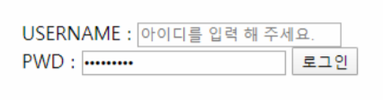

# HomeWork

### Semantic Tag

보기 중 콘텐츠의 의미를 명확히 하기 위해 HTML5에서 새롭게 추가된 시맨틱(semantic) 태그를 모두 고르시오.

```
div, header, h1, section, footer, a, form, span
```

**ans for 1:**

```python
header
section
footer
```


### input Tag

아래 이미지와 같이 로그인 Form을 생성하는 HTML코드를 작성하시오.
단, USERNAME 글자를 클릭하면 아이디를 입력하는 input에, PWD 글자를 클릭하면
비밀번호를 입력하는 input에 focusing 되도록 하시오.



**ans for 2:**

```html
<body>
  <form action"">
    <label for="username">USERNAME</label>
    <input id="username" type="text" placeholder="아이디를 입력 해 주세요">
    <br>
    <label for="pwd">PWD: </label>
    <input id="pwd"type="password">
    
    <input type="submit" value="로그인">
    
```


### 크기 단위

크기 단위 em은 요소에 지정된 상속된 사이즈나 기본 사이즈에 대해 상대적인 사이즈를 설정한다. 즉, 상속의 영향으로 사이즈가 의도치 않게 변경될 수 있는데 이를 예방하기 위해 HTML 최상위 요소의 사이즈를 기준으로 삼는 크기 단위는 무엇인가?

**ans for 3:**

```html
rem
-> root em의 약자
-> html tag에 font-size가 정의되어 있지 않다면? 브라우저의 기본 설정을 따라간다.
```


### 선택자

다음 예제를 통해 ‘자손 결합자’와 ‘자식 결합자’의 차이를 설명하시오.

```css
div p {
    color: crimson;
}

div > p {
    color: crimson;
}
```

**ans for 3:**

```html
자손 결합자: div의 모든 자식들(깊이 상관 ㄴ)에 스타일 적용
자식 결합자: div의 직속 관계에 대해서만 스타일 적용
```

