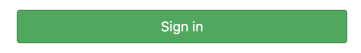
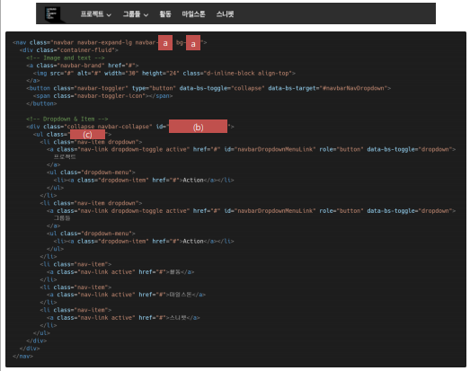
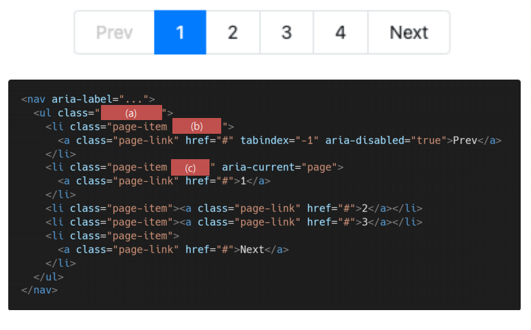

## Homework

- **Bootstrap**

**1. Components**



```html
<button type="submit" class="(a)">
    Sign in
</button>
```

**ans for 1:**

```html
(a): btn btn-success
```

```html
# 교수님 답변
(a): btn btn-success
```


**2. Components**



**ans for 2:**

```html
(a): dark
(b): navbarSupportedContent
(c): navbar-nav me-auto mb-2 mb-lg-0
```

```html
# 교수님 답변
(a): dark(앞쪽 a에 dark 넣으면 navbar의 테마가 dark로 바뀌기 때문에 해당 바의 글씨는 자동으로 흰색이 됨. 검정테마에 잘 맞는 흰 글씨로 자동 변경된다고 생각 ㄱ)
(b): navbarSupportedContent
(c): navbar-nav
```


**3. Components**



**ans for 3:**

```html
(a): pagination
(b): disabled
(c): active
```

```html
# 교수님 답변
(a): pagination
(b): disabled
(c): active
```


