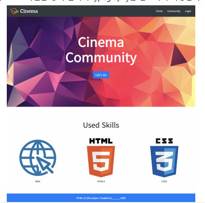
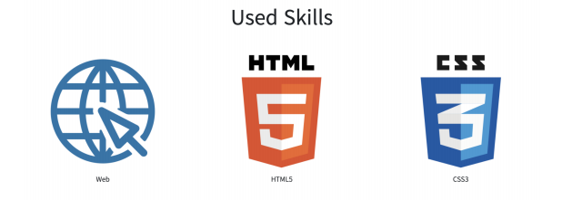

## Workshop

**1. Bootstrap Component**

아래의 페이지를 **Bootstrap Class**를 활용하여 작성하시오.
1) 각 요소(nav, header, section, footer)는 주어진 코드의 주석에 맞춰 작성합니다. 
2) 모든 이미지 요소는 주어진 이미지 파일을 활용합니다.
3) 모든 구성 요소 배치는 **flexbox**를 활용 합니다.
4) 모든 텍스트 스타일은 공식 문서의 typography를 참고하여 작성합니다



**2. Nav**

1) 네비게이션 바는 항상 브라우저 화면 최상단에 고정되어 있습니다.
2) 네비게이션 바의 배경색은 공식 문서의 **background color** 를 참고하여 작성합니다. 
3) 로고 이미지와 네비게이션 리스트는 각각 네비게이션 바 양 끝에 배치합니다.
4) 리스트의 항목 간 간격은 **2rem**입니다. 공식 문서의 spacing을 참고하여 작성합니다. 
5) 리스트의 각 항목들은 마우스를 올렸을 때, 밑줄이 나오지 않도록 설정합니다.
6) 위에 명시된 내용 이외에는 자유롭게 작성합니다. 


**3. Header**

1) Header 내부의 요소(글, 버튼)는 수직, 수평 중앙에 배치 합니다.
2) Header 내부의 글씨 색상은 흰색이며, **굵기는 bold** 입니다.
3) Header 내부의 글씨 크기는 공식 문서의 **display heading**을 활용합니다. 
4) Header 내부의 버튼의 색상은 **파란색**이며 크기는 크게 설정합니다.
5) 위에 명시된 내용 이외에는 자유롭게 작성합니다. 


**4. Section**

1) Section 내부의 요소(글, 이미지)는 **수평 중앙**에 배치 합니다.
2) Section 내부의 3개의 이미지는 **수평으로 나열**되어 있습니다.
3) Section 내부의 이미지간 **간격은 동일**합니다.
4) Section 내부의 이미지 아래에는 이미지를 설명하는 간단한 글이 있습니다. 
5) 위에 명시된 내용 이외에는 자유롭게 작성합니다. 



**5. Footer**

1) Footer는 항상 **브라우저 화면 최하단에 고정**되어 있습니다.
2) Footer의 배경색은 **파란색**입니다.
3) Footer에 작성된 내용은 수직, 수평 중앙에 배치 합니다.
4) Footer에 작성된 내용의 **빈 부분( _ )은 본인의 이름**을 작성해 주세요. 
5) 위에 명시된 내용 이외에는 자유롭게 작성합니다. 


**ans for 1:**

```html
```

