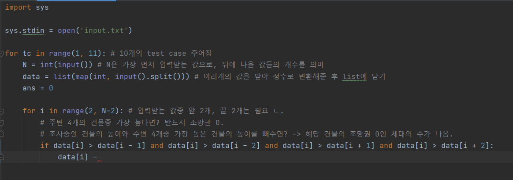
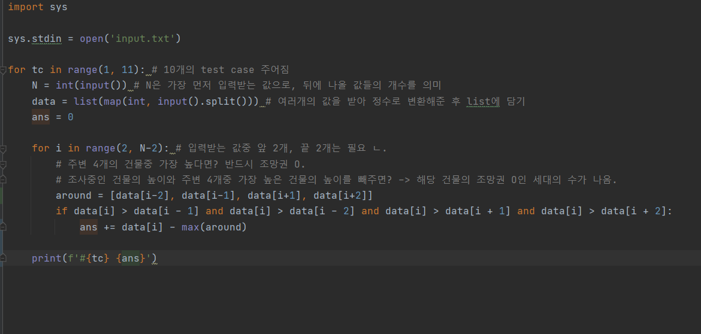
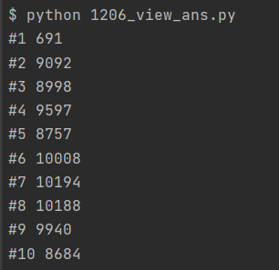

중간에 논리를 한번 바꿔 아직 여기까지밖에 작성하지 못했다.

흠..

data[i]에서 max(list), list = [data[i-2], data[i-1], data[i+1], data[i+2]]의 값을 빼줘야 하는데... max 없이 하려면 오늘 배운 정렬을 이용해 오름 or 내림차순으로 정리한 후 끝의 값을 받아와야 할 것이다.

버블정렬을 이용하면 될 것 같다

시간이 없어서 그냥 max 썼다. 허허.. 일단 제출하고, 천천히 버블정렬로 최댓값을 구해봐야 겠다.

