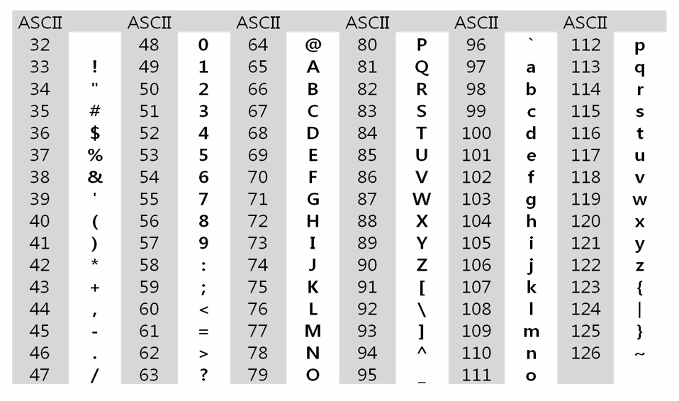

# String I


| Title     | Directory     | 비고 |
| --------- | ------------- | ---- |
| 연습문제1 | `p1`          | ppt  |
| 연습문제2 | `p2`          | ppt  |
| 연습문제3 | `1213_string` | swea |
| 1209_sum  | `1221_GNS`    | HW   |

### 연습문제 1 - 문자열 뒤집기


### 

```bash
4
algorithm
life is short
you need python
SSAFY
```

```bash
#1 mhtirogla
#2 trohs si efil
#3 nohtyp deen uoy
#4 YFASS
```


### 연습문제 2




```bash
5
3
1461
4671224
85761
-1
```

```bash
#1 5 <class 'str'>
#2 3 <class 'str'>
#3 1461 <class 'str'>
#4 4671224 <class 'str'>
#5 85761 <class 'str'>
#6 -1 <class 'str'>
```


### [연습문제 3 1213_string (with 고지식한 패턴 검색)](https://swexpertacademy.com/main/code/problem/problemDetail.do?contestProbId=AV14P0c6AAUCFAYi&categoryId=AV14P0c6AAUCFAYi&categoryType=CODE&problemTitle=1213&orderBy=FIRST_REG_DATETIME&selectCodeLang=ALL&select-1=&pageSize=10&pageIndex=1)


### [HomeWork.1221_GNS](https://swexpertacademy.com/main/code/problem/problemDetail.do?contestProbId=AV14jJh6ACYCFAYD&categoryId=AV14jJh6ACYCFAYD&categoryType=CODE&problemTitle=1221&orderBy=FIRST_REG_DATETIME&selectCodeLang=ALL&select-1=&pageSize=10&pageIndex=1)


### **+ extra**

6485. 삼성시의 버스노선

1859. 백만장자 프로젝트

4408. 자기 방으로 돌아가기

5356. 의석이의 세로로 말해요

1947. 스도쿠 검증

1961. 숫자 배열 회전
