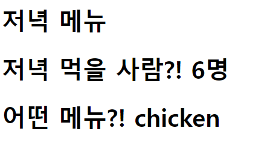

# WorkShop

### 결과 예시

결과 사진과 views.py, urls.py, dinner.html 파일의 코드를 별도의 마크다운 파일에 작성하여 제출하시오.




```python
# urls.py
from django.contrib import admin
from django.urls import path
from articles import views

urlpatterns = [
    path('admin/', admin.site.urls),
    path('dinner/', views.dinner)
]
```

```python
# views.py
def dinner(request):
    foods = 'chicken'
    num = 6
    context = {
        'foods': foods,
        'num': num,
    }
    return render(request, 'dinner.html', context)
```

```html
<!--dinner.html-->
<!DOCTYPE html>
<html lang="en">
<head>
    <meta charset="UTF-8">
    <meta http-equiv="X-UA-Compatible" content="IE=edge">
    <meta name="viewport" content="width=device-width, initial-scale=1.0">
    <title>Document</title>
</head>
<body>
    <h1>저녁 메뉴</h1>
    <h1>저녁 먹을 사람?! {{ num }}명</h1>
    <h1>어떤 메뉴?! {{ foods }}</h1>
</body>
</html>
```

