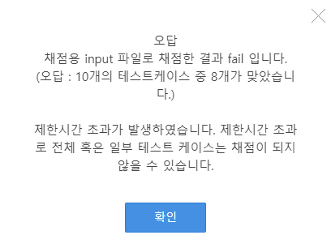
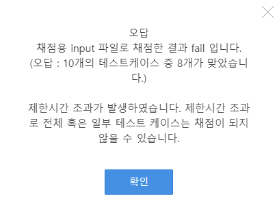

## 0330 HW

```python
# 병합정렬
# N개의 정렬 대상을 가진 리스트 L을 분할할 때 L[0:N//2], L[N//2:N]으로 분할
# 병합 과정에서 왼쪽 마지막 원소가 오른쪽 마지막 원소보다 큰 경우의 수를 출력
# 정렬이 끝난 리스트 L에서 L[N//2] 원소를 출력한다

def b_sort(arr):
    if len(arr) <= 1:
        return arr

    L_arr = [] # 좌측 리스트
    R_arr = [] # 우측 리스트
    middle = len(arr)//2
    for i in range(len(arr)):
        if i < middle:
            L_arr.append(arr[i])
        else:
            R_arr.append(arr[i])

    L_arr = b_sort(L_arr)
    R_arr = b_sort(R_arr)

    return merge(L_arr, R_arr)

def merge(Left, Right):
    global cnt
    result_list = []
    if Left[-1] > Right[-1]:
        cnt += 1

    while len(Left) > 0 or len(Right) > 0:
        if len(Left) > 0 and len(Right) > 0:
            if Left[0] <= Right[0]:
                result_list.append(Left[0])
                Left = Left[1:]
            else:
                result_list.append(Right[0])
                Right = Right[1:]
        elif len(Left) > 0:
            result_list.append(Left[0])
            Left = Left[1:]
        elif len(Right) > 0:
            result_list.append(Right[0])
            Right = Right[1:]

    return result_list

T = int(input())
for tc in range(1, T+1):
    N = int(input()) # 정수의 개수
    arr = list(map(int, input().split())) # 정렬해야 하는 요소들의 리스트

    cnt = 0
    ans = b_sort(arr)[N//2]

    print(f'#{tc} {ans} {cnt}')
```

위의 코드는 시간초과가 난 코드이다

시간초과를 해결하기 위해 생각해본 수정방안

1. ```python
   L_arr = [] # 좌측 리스트
   R_arr = [] # 우측 리스트
   middle = len(arr)//2
   for i in range(len(arr)):
       if i < middle:
           L_arr.append(arr[i])
       else:
           R_arr.append(arr[i])
   
   # 위의 코드를 아래의 코드로 수정
   
   middle = len(arr)//2
   L_arr = arr[:middel]
   R_arr = arr[middle:]
   ```

   

2. ```python
   # append 대신 += 이용하기
   
   while len(Left) > 0 or len(Right) > 0:
       if len(Left) > 0 and len(Right) > 0:
           if Left[0] <= Right[0]:
               result_list += [Left[0]]
               Left = Left[1:]
           else:
               result_list += [Right[0]]
               Right = Right[1:]
       elif len(Left) > 0:
           result_list += [Left[0]]
           Left = Left[1:]
       elif len(Right) > 0:
           result_list += [Right[0]]
           Right = Right[1:]
           
   # 이 수정은 코드의 속도에 큰 영향을 주지 못하는 듯 하다
   ```

3. ```python
   # len 함수 적게 쓰기
   
   lenleft = len(Left)
   lenright = len(Right)
   
   while lenleft > 0 or lenright > 0:
       if lenleft > 0 and lenright > 0:
           if Left[0] <= Right[0]:
               result_list += [Left[0]]
               Left = Left[1:]
               lenleft -= 1
               
   # len(Left)와 len(Right)를 변수로 지정하고, 해당 리스트가 줄어들 때마다 lenleft, lenright의 길이를 1씩 감소기켜 주었다
   ```

   

4. ```python
   # 내일 조원들의 코드를 보고 공부한다
   
   -> 정답
   ```

   