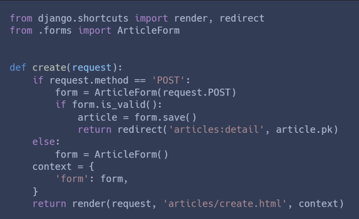

## 0407 HW

1. 아래 작성된 views.py의 코드 일부를 보고 문제에 알맞은 답을 서술하시오

1-1. 왜 변수 context 저기 있나

게시글 생성 POST 요청이 유효성 검사를 통과하지 못했을 때, 통과하지 못한 데이터를 포함한 form을 create.html에 보내서 사용자에게 다시 글을 작성하도록 하기 위해

+

form 인스턴스는 에러메시지도 함께 가지고 있기 때문에, 어떤 부분에 문제가 생겼는지도 알려 줄 수 있음

2-2. 왜 request의 http method는 POST 먼저 확인하도록 작성하는가?

POST 요청일 때만 db 조작 할 수 있도록, 관련된 로직이 동작하도록 하고

POST메서드가 아닌 다른 메서드들은 서버 내부에 영향을 미치지 않는 빈 폼만 넘겨주면 된다