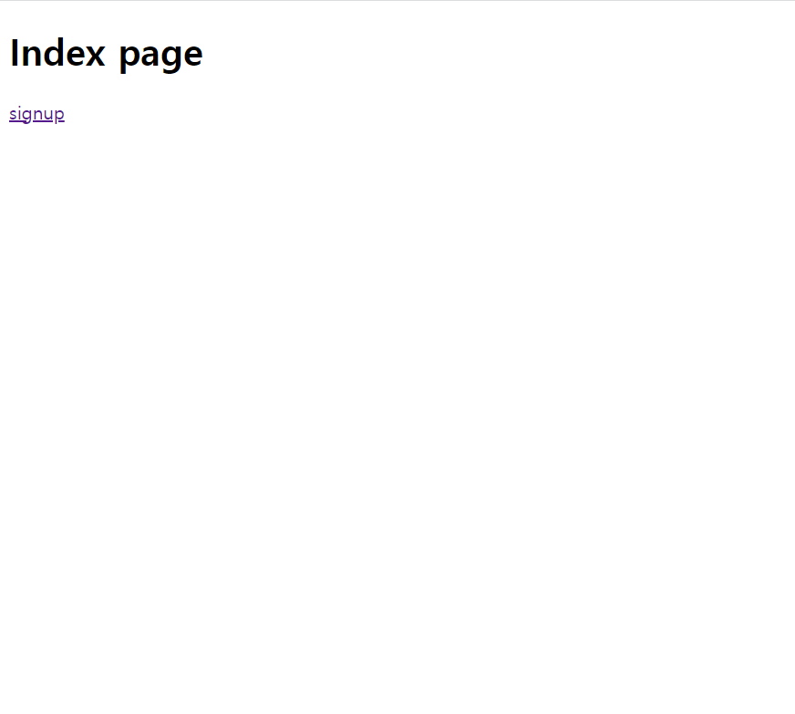
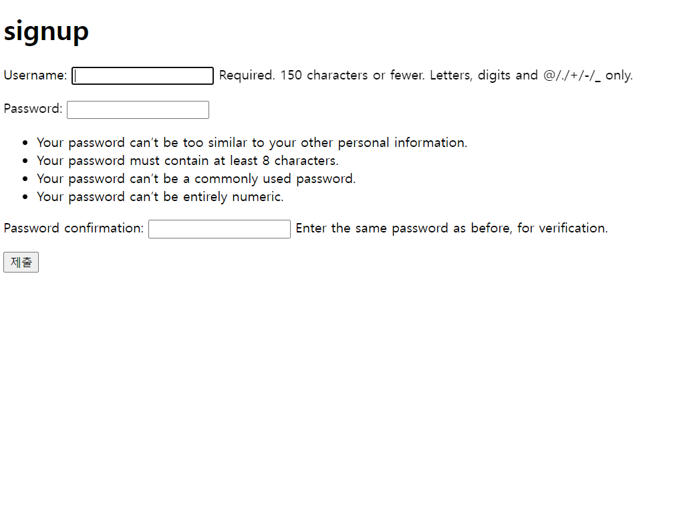
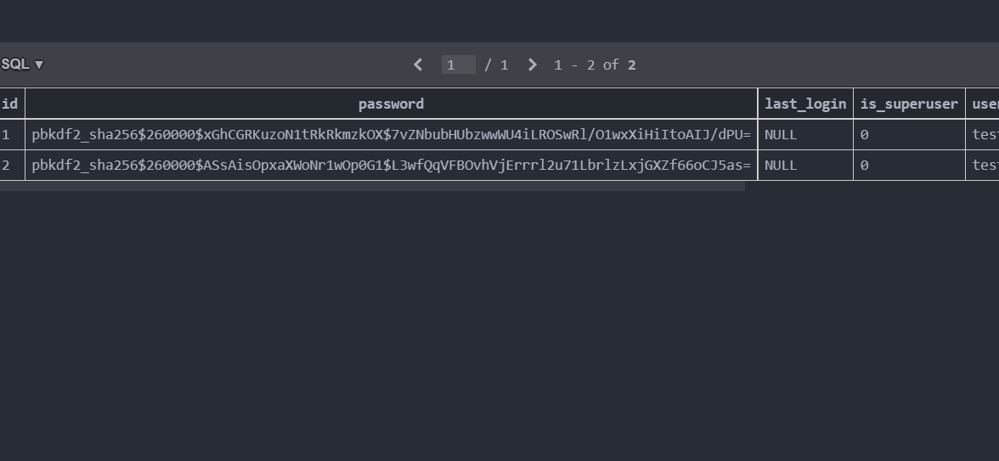

## workshop

**/accounts/ : 유저 목록 출력 페이지**

**/accounts/signup/ : 회원가입 작성위한 페이지, 유저 생성기능**


1. /accounts/ 화면



실패. 데이터베이스의 유저 목록을 어떻게 받아와야 할지 잘 모르겠다...


2. 회원가입 페이지의 구현



위의 화면처럼 회원가입을 할 수 있는 화면을 만들었다.

회원가입 결과 데이터베이스에 유저의 정보가 저장되는 것 또한 볼 수 있었다.




```python
# views.py

from django.shortcuts import render, redirect
from django.contrib.auth import get_user_model
from django.contrib.auth.forms import UserCreationForm

# Create your views here.
def index(request):
    form = get_user_model().objects.all()
    context = {
        'form':form,
    }
    return render(request, 'accounts/index.html', context)


def signup(request):
    if request.method == 'POST':
        form = UserCreationForm(request.POST)
        if form.is_valid():
            form.save()
            return redirect('accounts:index')
    else:
        form = UserCreationForm()
    context = {
        'form':form,
    }
    return render(request, 'accounts/signup.html', context)
```

