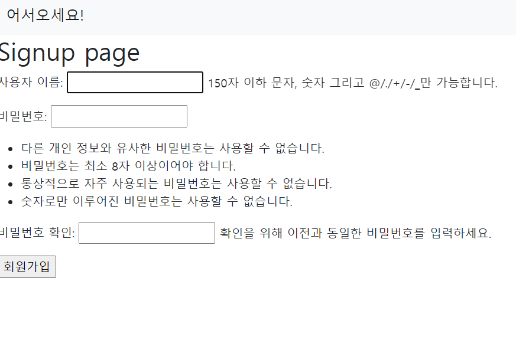
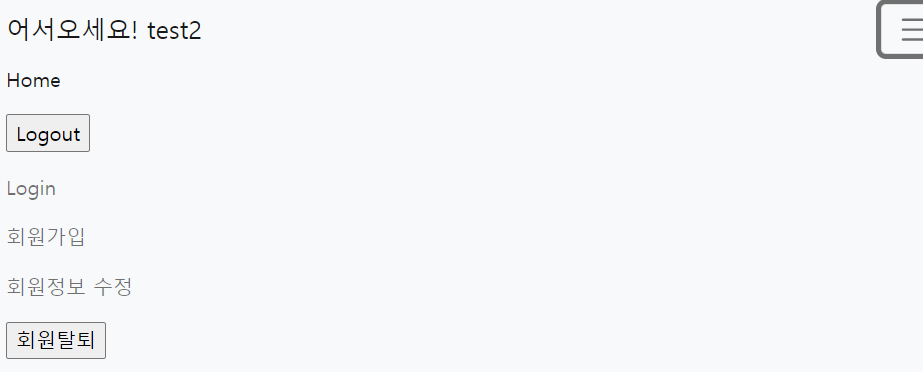
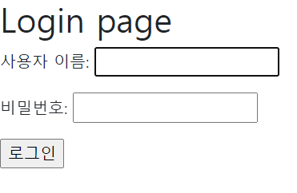
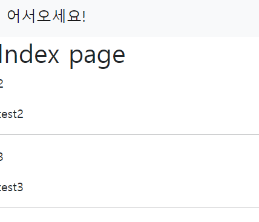
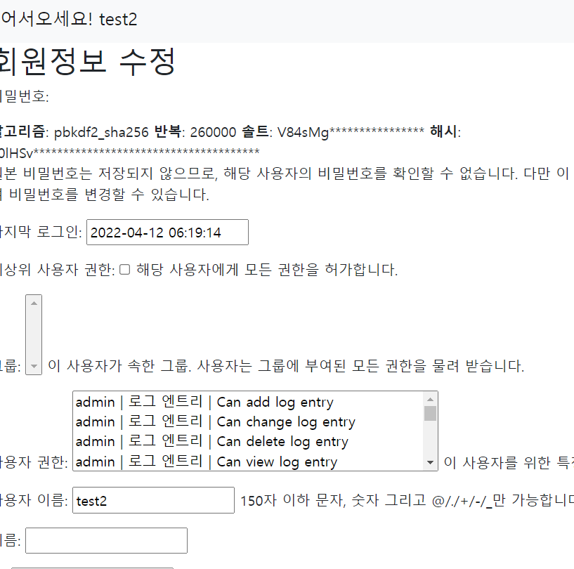
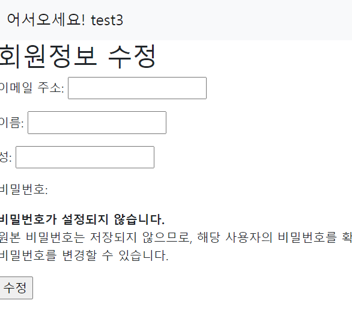
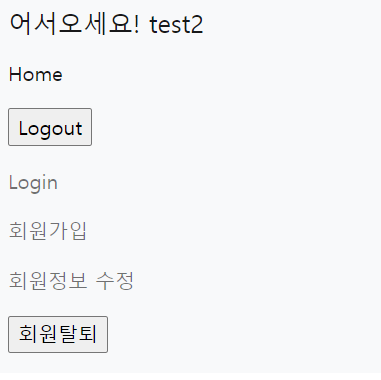
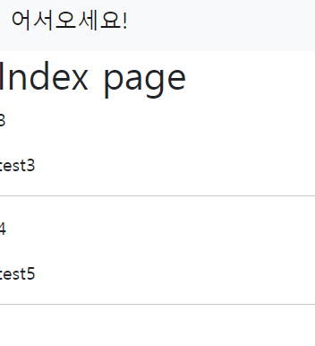

## 0412 practice

1. 회원가입 기능 구현



2. 로그인 기능 구현. 로그인 하면 navbar에 유저 정보, 로그아웃, 회원수정, 회원탈퇴 등의 정보가 표시됨

-> 로그인시/로그아웃시 다른 화면을 보여주는 기능은 아직 구현하지 않았다,,, 일단 기능 구현만,,,



일단 navbar에 필요한 기능들을 모두 넣어두었다



login 화면

(login 되어있을 땐 해당 화면으로 넘어가지 않도록 처리해야 하는데... 우선 필요한 기능을 모두 구현한 뒤 하나씩 추가해보겠다)


3. 로그아웃 기능 구현. 로그아웃 하면 navbar에 회원가입 및 로그인의 정보가 표시됨



logout 버튼을 누르면 어서오세요! user에서 어서오세요!로 바뀌게 된다. 현재 로그인중인 user의 정보를 navbar에 노출되게 하였으니, 위의 사진은 로그아웃되었다는 증거가 될 수 있을 것.


4. 회원정보 수정 기능 구현. 회원정보 수정 페이지에서는 이메일 주소 및 이름과 성만 수정 가능하도록 수정한다



회원정보 수정의 경우 아직 customform을 적용하지 않았다.

+

회원정보 수정의 경우 로그인된 상태에서 들어가면 잘 작동되나, 로그인되지 않은 상태에서 들어가면 에러가 뜬다. 에러가 아닌, 로그인창이 뜰 수 있도록 바꾸어 봐야겠다.

+

customform 적용하기

a. accounts 폴더에 forms.py 파일을 만든다

b. forms.py에 적절한 파일들을 import 받는다.

```python
# accounts > forms.py

from django import forms
from django.contrib.auth.forms import UserChangeForm
from django.contrib.auth import get_user_model
```

c. class를 작성한다

```python
# accounts > forms.py

class CustomUserChangeForm(UserChangeForm):
    
    class Meta:
        model = get_user_model()
        fields = ('email', 'first_name', 'last_name')
```

d. views.py의 form 명을 바꿔준다

```python
# accounts > views.py

from .forms import CustomUserChangeForm

# update 함수의 UserChangeForm 부분을 CustomUserChangeForm으로 바꿔주자
```


결과




5. 회원탈퇴기능 구현. POST method일 때만 삭제 가능하도록 작성한다



회원탈퇴 버튼을 누르면



user 목록에서 test2가 사라진 것을 볼 수 있다.

+

회원탈퇴의 경우, 로그인 하지 않은 상태에서 눌러도 별다른 에러는 뜨지 않는 것 같다. 수정의 경우 request.user 정보가 필요해 해당 정보를 받지 않으면 에러를 보여주지만, 탈퇴의 경우 해당 정보가 필요하지 않기 때문에 별다른 에러를 보여주진 않는걸까,,

**views.py**

```python
# views.py

from django.shortcuts import render, redirect
from django.contrib.auth import get_user_model, login as auth_login
from django.contrib.auth import logout as auth_logout
from django.contrib.auth.forms import UserCreationForm, AuthenticationForm, UserChangeForm
from django.views.decorators.http import require_http_methods
from django.views.decorators.http import require_POST

# User = get_user_model()
# Create your views here.
def index(request):
    users = get_user_model().objects.all()
    context = {
        'users':users,
    }
    return render(request, 'accounts/index.html', context)

@require_http_methods(['GET', 'POST']) # get, post 이외의 요청일 경우 405에러. 그걸 방지하기 위해 작성해주는 데코레이터
def signup(request):
    if request.method == 'POST':
        form = UserCreationForm(request.POST)
        if form.is_valid():
            form.save()
            return redirect('accounts:index')
    else:
        form = UserCreationForm()
    context = {
        'form':form,
    }
    return render(request, 'accounts/signup.html', context)


def login(request):
    if request.method == 'POST':
        form = AuthenticationForm(request, request.POST) # login의 경우 두번째 인자로 data가 들어감
        if form.is_valid():
            auth_login(request, form.get_user()) # login 함수는 2개의 인자를 받음
            # AuthenticationForm이 실제 로그인을 진행시켜주지는 않음. 로그인은 login 함수(지금 작성중인 것 아님)가 해줌
            # get_user()라는 AuthenticationForm이 갖고있는 메서드를 이용
            # get_user()는 위의 폼을 이용해 인증된 user 객체가 return됨
            return redirect('accounts:index')
    else:
        form = AuthenticationForm()
    context = {
        'form':form,
    }
    return render(request, 'accounts/login.html', context)


def logout(request):
    auth_logout(request)
    return redirect('accounts:index')

@require_http_methods(['GET', 'POST'])
def update(request):
    if request.method == 'POST':
        form = UserChangeForm(request.POST, instance=request.user)
        if form.is_valid():
            form.save()
            return redirect('accounts:index')
    else:
        form = UserChangeForm(instance=request.user)
    context = {
        'form':form,
    }
    return render(request, 'accounts/update.html', context)

@require_POST
def delete(request):
    if request.user.is_authenticated:
        request.user.delete()
        auth_logout(request)
    return redirect('accounts:index')
```

