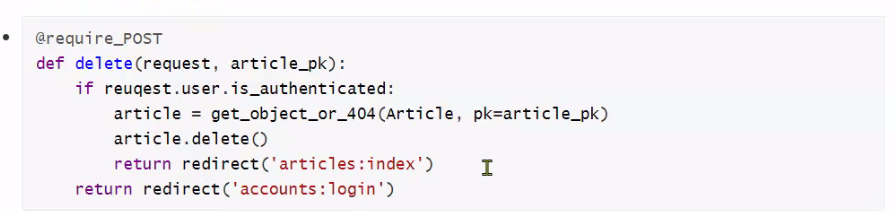

## 0413 HW

1. 1:N T/F

각 문항을 읽고 옳으면 T, 틀렸으면 F

- ForeignKey는 부모 테이블의 데이터를 참조하기 위한 키이다 `T`

**설명: foreignkey는 참조중인 테이블의 pk값을 foreignkey 필드에 넣어 관리하는 것(꼭 pk값이 아니어도 됨)**

- 1:N 관계에서 1은 N의 데이터를 직접 참조 할 수 있다 `F`

**설명: 1(참조되는 객체)은 N(참조하는 객체)에 대한 정보를 갖고있지 않음. 그래서 직접 참조는 안되지만 '역참조매니저'를 활용해 DBAPI로 불러올 수 있다.**

- on_delete 속성은 ForeignKey 필드의 필수 인자이다 `T`

**설명: on_delete 속성은 무엇을 정의하는가? 참조대상객체와 참조하는객체간의 삭제로직. 참조중인 대상(1)이 삭제되었을 때, 우리를 어떻게 처리 할 것인가?**

- 1:N 관계에서 외래 키는 반드시 부모 테이블의 PrimaryKey여야 한다 `F`

**설명: 반드시 부모의 pk가 아니더라도, 고유값이기만 하면 됨.**


2. ForeignKey column name

다음과 같이 이름이 articles인 app의 models.py에 작성된 코드를 바탕으로 테이블이 만들어 졌을 때, 데이터베이스에 저장되는 ForeignKey 컬럼의 이름과 테이블의 이름이 무엇인지 작성하시오

```python
# ans

컬럼의 이름: asnwer_id
테이블의 이름: articles_comment
```

```python
from django.db import models

class Question(models.Model):
    title = models.CharField(max_length=50)

class Comment(models.Model): # foreignkey 갖고있는 클래스의 소문자ver을 articles_뒤에 붙이면 테이블의 이름
    answer = models.ForeignKey(Question, on_delete=models.CASCADE) # 얘에 _id붙이면 컬럼의 이름
    content = models.CharField(max_length=100)
```


3. 1:N model manager

위 2번 문제 모델 관계를 바탕으로 어느 template 페이지가 다음과 같이 작성되어 있을 때, 질문(Question)에 작성된 모든 댓글(Comment)을 출력하고자 한다. 해당 template에서 Question 객체를 사용할 수 있다면, 빈칸 __(a)__에 들어갈 알맞은 코드를 작성하시오

```html

  <p>{{ comment.content }}</p>

```

```python
# ans

get_object_or_404(Question, pk=pk).comment_set.all()
```

Question 객체를 question이라는 key값에 담아 넘겨주었다고 가정.

-> **ans: question.comment_set.all (파이썬이 아닌 DTL이므로 ()를 이용한 함수호출은 할 수 없음)**


4. next parameter

다음과 같이 게시글을 삭제하는 delete함수와 로그인을 위한 login 함수가 작성되어 있다. 만약 비로그인 사용자가 삭제를 시도한다면, django는 해당 사용자를 url에 next 파라미터가 붙은 login 페이지로 redirect 한다.

- `/accounts/login/?next=/articles/1/delete/`

a) redirect된 로그인 페이지에서 로그인에 성공했을 때 발생하는 HTTP response status code를 작성하고, 이 오류가 발생한 원인을 작성하시오

```python
# ans
405 Method Not Allowed
next로 넘어갔을 땐 get요청이기 때문에 POST요청이어야 하는 delete함수를 실행시킬 수 없음.
```


b) 위에서 발생한 오류를 해결하기 위해 다음과 같이 동작하는 코드로 수정하시오.
▪ 게시글 삭제는 HTTP POST method로만 가능하다.
▪ 인증되지 않은 사용자가 게시글 삭제를 시도하는 경우, 해당 게시글 상세페이지로
redirect 되도록 한다. (게시글은 삭제되지 않는다.)

```python
# ans

@require_POST
def delete(request, pk):
    article = get_object_or_404(Article, pk=pk)
    if request.user.is_authenticated: # 인증된 유저이면서
        if request.user == article.user: # 요청을 보낸 유저와 게시글 작성자가 같으면
            article.delete() # 삭제
    return redirect('articles:index')
```

**교수님 답변**



```python
from django.views.decorators.http import require_POST
from django.contrib.auth.decorators import login_required
from django.shortcuts import render, redirect, get_object_or_404
from .models import Article

@login_required
@require_POST
def delete(request, article_pk):
    article = get_object_or_404(Article, pk=article_pk)
    article.delete()
    return redirect('articles:index')

def login(request):
    if request.user.is_authenticated:
        return redirect('articles:index')
    if request.method == 'POST':
        form = AuthenticationForm(request, request.POST)
        if form.is_valid():
            auth_login(request, form.get_user())
            return redirect(request.GET.get('next') or 'articles:index') # 요청 페이지로 넘기거나 index를 redirect해주거나
    else:
        form = AuthenticationForm()
    context = {
        'form':form,
    }
    return render(request, 'accounts/login.html', context)
```

