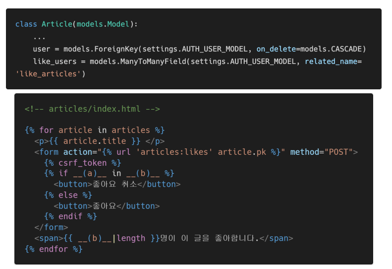
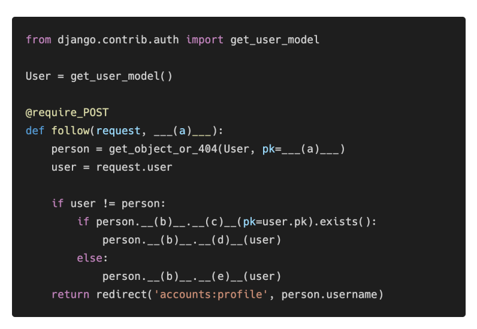
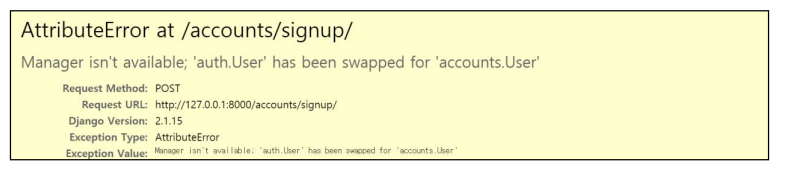
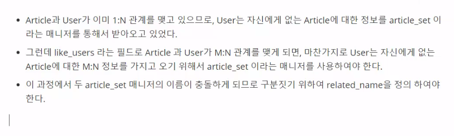
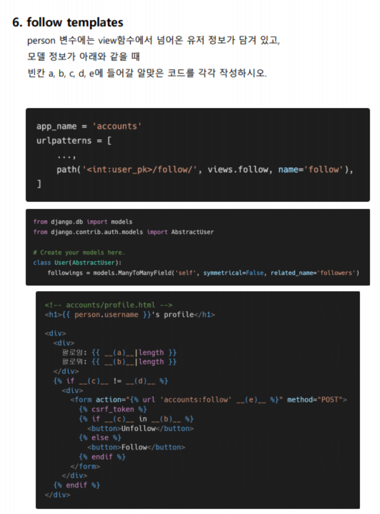

# HomeWork
### M:N True or False

각 문항을 읽고 맞으면 T, 틀리면 F를 작성하고, 틀렸다면 그 이유도 함께 작성하시오.

1) Django에서 1:N 관계는 ForeignKeyField를 사용하고, M:N 관계는 ManyToManyField를 사용한다. `T`
2) ManyToManyField를 설정하고 만들어지는 테이블 이름은 “앱이름_클래스이름_지정한 필드이름”의 형태로 만들어진다. `T`
3) ManyToManyField의 첫번째 인자는 참조할 모델, 두번째 인자는 related_name이 작성 되는데 두 가지 모두 필수적으로 들어가야 한다. `F` `related_name 사용이 권장되는 경우가 있지만, 반드시 들어가야 하는 것은 아니다`


### Like in templates

아래 빈 칸 (a)와 (b)에 들어갈 코드를 각각 작성하시오.



`ans: (a): user(or request.user)(request는 기본적으로 render할때 담아줌), (b): article.like_users.all`


### Follow in views

모델 정보가 다음과 같을 때 빈칸 a, b, c, d, e에 들어갈 코드를 각각 작성하시오.




`ans: (a): user_pk, (b): followers, (c): filter, (d): remove, (e): add`

### User AttributeError

다음과 같은 에러 메시지가 발생하는 이유와 이를 해결하기 위한 방법과 코드를 작성하시오.



`ans:  UserCreationForm이 auth.User 모델을 참도하고 있는데, 해당 유저 모델이 변동하였으므로 문제가 발생하였다. 이를 해결하기 위해 UserCreationForm을 상속받은 새 ModelForm으로 대체해야 한다.`

```python
from django.contrib.auth.forms import UserCreationForm
from django.contrib.auth import get_user_model

class CustomUserCreationForm(UserCraetionForm):
    
    class Meta(UserCreationForm.Meta):
        model = get_user_model()
        fields = UserCreationForm.Meta.fields
```


### related_name

아래의 경우 ForeignKey 혹은 ManyToManyField에 related_name을 필수적으로 작성해야 한다. 그 이유를 설명하시오. 


`ans: 역참조시 이름을 설정해주지 않아 충돌이 일어날 수 있다.`






`ans: (a): person.followings.all, (b): person.followers.all, (C): user(또는 request.user), (d): person, (e): person.pk`