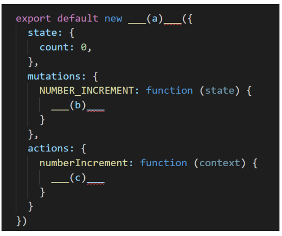
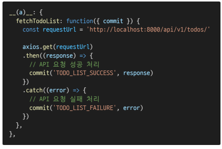
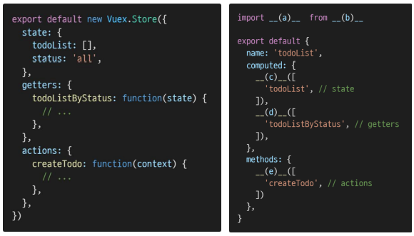

# HomeWork
다음은 Vuex로 구성된 하나의 숫자를 counting하는 store이다. (a), (b), (c)에 들어갈 코드를 작성하시오.

- NUMBER_INCREMENT mutation handler가 호출되면 state의 count를 1만큼 증가시킨다.

  

(a): Vuex.Store

(b): state.count ++

(c): context.commit('NUMBER_INCREMENT')

아래 예시의 함수는 서버로부터 데이터를 가져 온 뒤, 응답 값을 state에 저장하기 위하여 mutations를 호출하는 로직을 수행한다. 이와 같이 비동기 API 및 mutations 호출에 적합한 store의 속성 (a)를 작성하시오

(a): actions

왼쪽처럼 store에 state, getters, actions가 정의되어 있다. “Component Binding Helpers”를 통해 각 컴포넌트에서 사용하고자 한다. [Vuex 공식문서](https://v3.vuex.vuejs.org/kr/api/#%E1%84%8F%E1%85%A5%E1%86%B7%E1%84%91%E1%85%A9%E1%84%82%E1%85%A5%E1%86%AB%E1%84%90%E1%85%B3-%E1%84%87%E1%85%A1%E1%84%8B%E1%85%B5%E1%86%AB%E1%84%83%E1%85%B5%E1%86%BC-%E1%84%92%E1%85%A6%E1%86%AF%E1%84%91%E1%85%A5)를 참고하여 빈 칸 (a), (b), (c), (d), (e)에 들어갈 코드를 작성하시오.

(a): { mapGatters }

(b): 'vuex'

(c): ...mapState

(d): ...mapGetters

(e): ...mapActions

store에 정의한 state를 직접 변경하지 않고, mutations를 통해 변경해야 하는 이유를[ Vuex 공식문서](https://v3.vuex.vuejs.org/kr/api/#%E1%84%8F%E1%85%A5%E1%86%B7%E1%84%91%E1%85%A9%E1%84%82%E1%85%A5%E1%86%AB%E1%84%90%E1%85%B3-%E1%84%87%E1%85%A1%E1%84%8B%E1%85%B5%E1%86%AB%E1%84%83%E1%85%B5%E1%86%BC-%E1%84%92%E1%85%A6%E1%86%AF%E1%84%91%E1%85%A5)를 참고하여 작성하시오

`명확한 역할 분담을 통해 서비스 규모가 커져도 state를 올바르게 관리하기 위함`